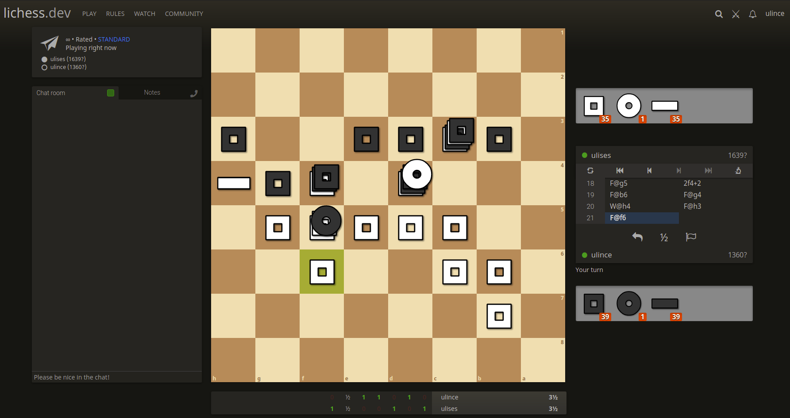

# Litak (Lichess for tak)



# [Tak](https://en.wikipedia.org/wiki/Tak_(game))

***Tak*** is a two-player game seen in the book: The Wise Man's Fear from the Kingkiller Chronicle. The game's objective is to create a path from one side of the board to the other following the: [Rules](https://cheapass.com/wp-content/uploads/2016/07/Tak-Beta-Rules.pdf), or [Video](https://www.youtube.com/watch?v=iEXkpS-Q9dI)

## Adaptation to 2d play:

Using lichess crazyhouse tools, we have the stones to place according to the 8x8 tak rules. 

To select how many stones to move I'm using the scroll wheel rendering the stones to be moved a bit higher (open to debate), this is way heavier than lichess' redering method. 

## Specs:

Litak ([lichess](https://github.com/ornicar/lila) for tak) is a free online tak game server.

Litak is written in [Scala 2.13](https://www.scala-lang.org/),
and relies on the [Play 2.8](https://www.playframework.com/) framework.
[scalatags](https://www.lihaoyi.com/scalatags/) is used for templating.
The tak logic is contained in the module tak (when stable will be taken apart from litak).
The server is fully asynchronous, making heavy use of Scala Futures and [Akka streams](https://akka.io).
WebSocket connections are handled by a [separate server](https://github.com/ulince/litak-ws) that communicates using [redis](https://redis.io/).
It uses [MongoDB](https://mongodb.org) to store more than 1.7 billion games, which are indexed by [elasticsearch](https://github.com/elastic/elasticsearch).
HTTP requests and WebSocket connections can be proxied by [nginx](https://nginx.org).
The web client is written in [TypeScript](https://www.typescriptlang.org/) and [snabbdom](https://github.com/snabbdom/snabbdom), using [Sass](https://sass-lang.com/) to generate CSS.
The [blog](https://lichess.org/blog) uses a free open content plan from [prismic.io](https://prismic.io).
Browser testing done with [](https://www.browserstack.com).
Proxy detection done with [IP2Proxy database](https://www.ip2location.com/database/ip2proxy).

See [lichess.org/source](https://lichess.org/source) for a list of repositories.

# TODO:

- [ ] Move several squares in one move
- [ ] Flatten wallstones with capstones
- [ ] First move with opposite color
- [ ] Animations

## Installation

```
./lila # thin wrapper around sbt
run
```

The Wiki describes [how to setup a development environment](https://github.com/ornicar/lila/wiki/Lichess-Development-Onboarding). <-- Litak runs like Lila

## Credits

Most of the code comes from Lila and it's contributors, so thanks to them. And thanks to [lishogi](https://github.com/WandererXII/lishogi), [lidroughts](https://github.com/RoepStoep/lidraughts) for setting the precedent.

See the [contributors](https://github.com/ornicar/lila/graphs/contributors) on this repository and [lichess.org/thanks](https://lichess.org/thanks).

## Supported browsers

| Name              | Version | Notes                                             |
| ----------------- | ------- | ------------------------------------------------- |
| Chromium / Chrome | last 10 | Full support                                      |
| Firefox           | 61+     | Full support (fastest local analysis since FF 79) |
| Opera             | 55+     | Reasonable support                                |
| Safari            | 11.1+   | Reasonable support                                |
| Edge              | 17+     | Reasonable support                                |

Older browsers (including any version of Internet Explorer) will not work.
For your own sake, please upgrade. Security and performance, think about it!

## License

Lila is licensed under the GNU Affero General Public License 3 or any later
version at your choice with an exception for Highcharts. See COPYING for
details.

So litak the same.